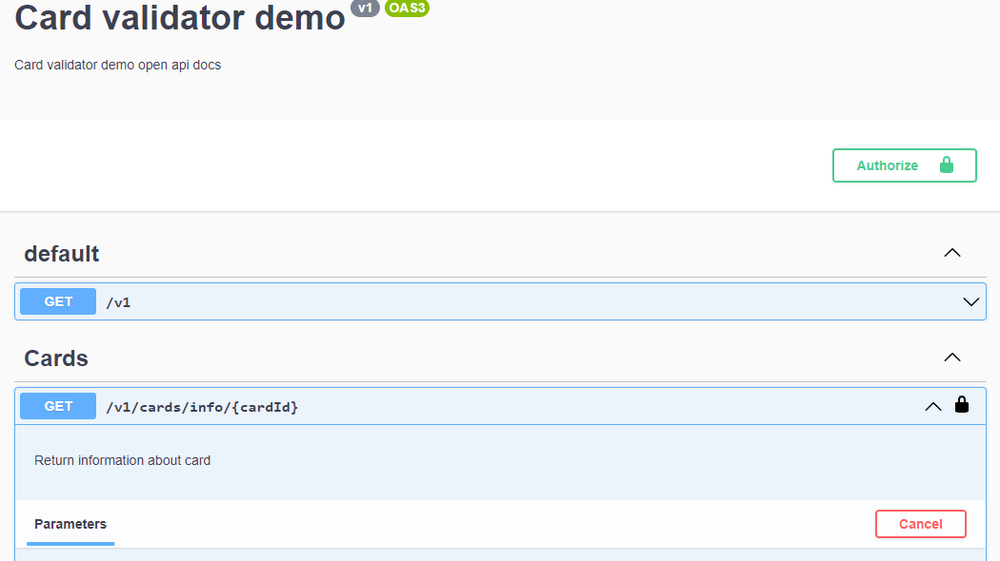

# Card validator demo in nestjs

## Prerequisites
- Installed nodejs (recommended at least version **^14**)

## Installation

### Run installation
```shell
npm i
```

### Copy .env file
```shell
cp .env.example .env
```

## Start application
```shell
npm run start:dev
```

- For api explorer visit [http://localhost:3000/explorer](http://localhost:3000/explorer)
- For api doc json visit [http://localhost:3000/explorer-json](http://localhost:3000/explorer-json)

### Authentication
App is protected with api key which is by default ```not-secret-key```. It must be sent in header with name x-api-key.
It can be defined in swagger explorer via authorize button in upper right corner.


## Tests
1. Execute test
```shell
npm test
```

2. Execute test with coverage
```shell
npm run test:cov
```
